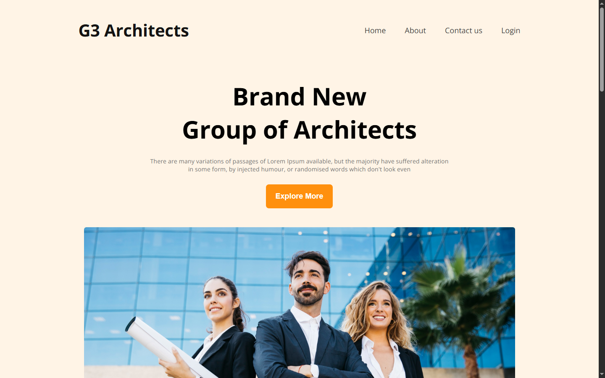

# G3 Architect Website

A modern, responsive portfolio website for **G3 Architect** — a brand new group of architects.

 
## 🚀 Live Demo

[View Live Website](https://md-moynul.github.io/g3-architect-website/)

## 🌟 Features

- Fully responsive design (Desktop + Mobile)
- Clean and modern architecture portfolio layout
- Easy to edit and customize
- Drag & drop friendly structure (if using a builder later)
- Fast loading static website (HTML + CSS only)

## 📄 Pages / Sections

- **Homepage** – Hero introduction as "Brand New Group of Architects"
- **Features** – Highlights modern design, responsiveness, etc.
- **Experience** – 10+ Years Experience
- **Facts** – Awards, Projects, Clients, etc.
- **Sponsors** section

## 🛠️ Technologies Used

- HTML5
- CSS3
- Responsive Design (Mobile-First)

